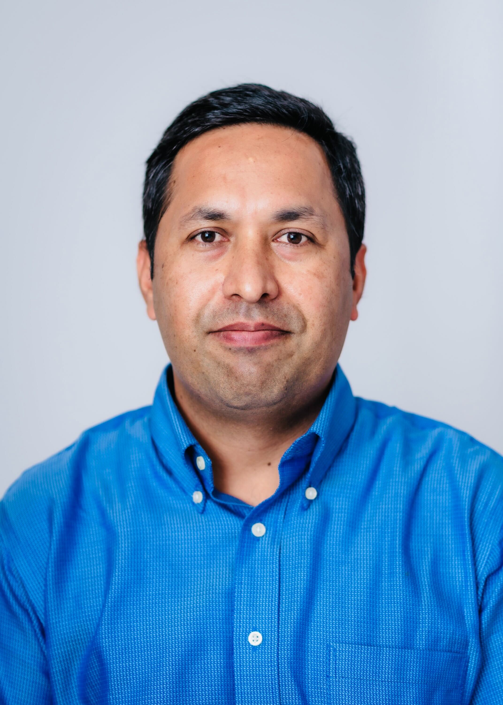

# Jeevan B. GC, PhD

Senior AI Scientist — Peptide Design, AbbVie

 USA 

<a href="mailto:jeevanb.gc.23@gmail.com">Contact</a> ·
<a href="https://scholar.google.com/citations?user=Vu5JRU0AAAAJ&amp;hl=en&amp;oi=ao">Google Scholar</a> ·
<a href="https://github.com/jeevanbgc">GitHub</a> ·
<a href="https://www.researchgate.net/profile/Jeevan_G_C">ResearchGate</a> ·
<a href="https://www.linkedin.com/in/jeevan-gc-ph-d-73a26660/">LinkedIn</a> ·
<a href="https://drive.google.com/drive/folders/1PesLK2PC3TAmO7VHAGfeJnp50besS-ic">Curriculum Vitae</a>

## About

I am a Senior AI Scientist working on peptide design at AbbVie. Before that, I was a Computational Chemistry Scientist I at the Center for Protein Degradation, Dana-Farber Cancer Institute, Boston, MA, where I used computational chemistry, biophysics, to investigate small molecules targeting therapeutically important proteins. At Columbia University in Prof. Joachim Frank Lab (Nobel Laureatte in Chemistry 2017), I solved high resolution map of ribosome and viral RNA complex using single-particle cryo-EM.

My research combines physics-based molecular dynamics simulations, machine learning, statistical physics, and quantum mechanics to understand the motion and behavior of biomolecules — proteins, membranes, and small molecules.

## Education

**PhD, Theoretical and Computational Biophysics**
Florida International University, Miami, FL
Advisors: [Dr. Prem P. Chapagain](http://faculty.fiu.edu/~chapagap/) and [Dr. Bernard S. Gerstman](http://faculty.fiu.edu/~gerstman/)

**MSc, Theoretical Physics**
Florida International University, Miami, FL

**BSc, MSc, Theoretical Physics**
Tribhuvan University, Kathmandu, Nepal

## Employment History

- AbbVie, USA (present)
- Grafton Biosciences (2025)
- The Centre for Protein Degradation — Dana-Farber Cancer Institute, Boston MA (2022-2024)
- [Professor Joachim Frank Lab](https://joachimfranklab.org/the-team/) — Columbia University, New York, NY (2020-2022)
- [Dr. Senthil Natesan Lab](https://labs.wsu.edu/modeling-and-simulation-lab/people/) — Washington State University, Spokane, WA (2017-2020)

---

See [Publications](publications.md) and [Research](research.md) for more on my work.
