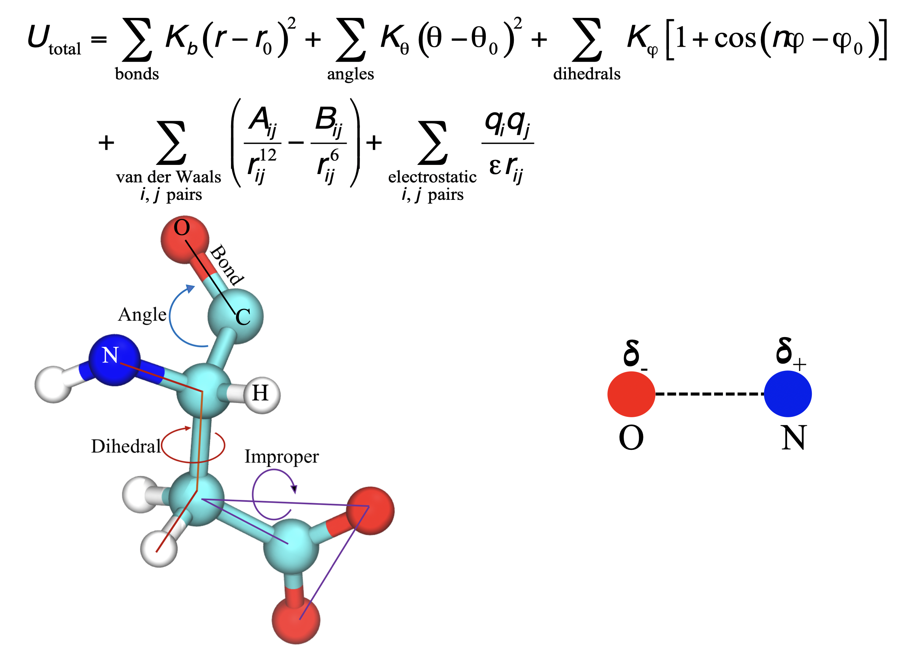

## About

I completed my MSc in theoretical physics in Nepal, then moved to the United States to pursue my PhD research in computational biophysics at Florida International University. There, I utilized physics-based molecular dynamics (MD) simulations to uncover folding of "Transformer" proteins such as RfaH transcription factor and protein-membrane interactions. At Washington State University, I developed computational pipelines (both physics-based and generative AI) for membrane partitioning of small molecules, which provided important insight into membrane protein structure, dynamics and function. Building on this foundation in computational biophysics, I moved to ***Columbia University to join the lab of Prof. Joachim Frank (2017 Nobel Laureate in Chemistry)***, where I gained hands-on experience solving high-resolution cryo-EM map of ribosome and viral RNA complexes. This structural perspective then led me to the Center for Protein Degradation at Dana-Farber Cancer Institute in Boston, MA, where I  developed novel computational chemistry and biophysics approaches to study small molecules (molecular glues) targeting therapeutically important proteins. Today, I bring this combined background in structural biology, computationl biophysics, and  chemistry to my current role as a Senior AI Scientist at AbbVie, where I focus on AI-driven peptide design.

My research integrates physics-based MD simulations, machine learning, statistical physics, and quantum mechanics to understand the motion and behavior of biomolecules including proteins, membranes, and small molecules.

## Education

**PhD, Theoretical and Computational Biophysics**  
Florida International University, Miami, FL  
Advisors: [Dr. Prem P. Chapagain](http://faculty.fiu.edu/~chapagap/) and [Dr. Bernard S. Gerstman](http://faculty.fiu.edu/~gerstman/)

**MSc, Theoretical Physics**  
Florida International University, Miami, FL

**MSc, Theoretical Physics**  
Tribhuvan University, Kathmandu, Nepal

## Employment History

- **Senior AI Scientist** — AbbVie, USA (2026–Present)
- **Member of Technical Staff** — Grafton Biosciences (2025)
- **Computational Chemistry Scientist I** — The Centre for Protein Degradation, Dana-Farber Cancer Institute, Boston, MA (2022–2024)
- **Postdoctoral Research Scientist** — [Professor Joachim Frank Lab](https://joachimfranklab.org/the-team/), Columbia University, New York, NY (2020–2022)
- **Postdoctoral Research Associate** — [Dr. Senthil Natesan Lab](https://labs.wsu.edu/modeling-and-simulation-lab/people/), Washington State University, Spokane, WA (2017–2020)

---

See [Publications](publications.md), [Research](research.md), and [Projects](project.md) for more on my work.